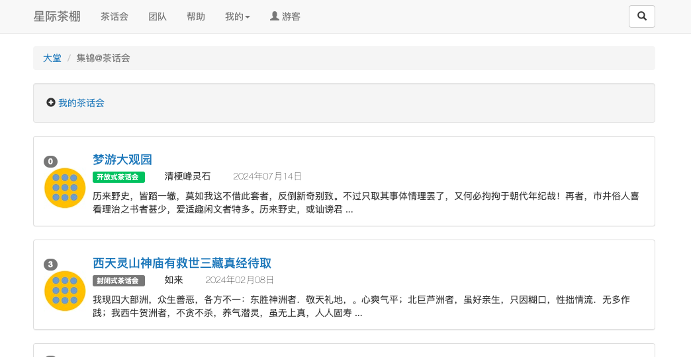

# teachat-readme.md

## 简介
为讨论鸡毛蒜皮的事而编造的web应用。  
叫 XX@茶话会。  

### 设想中的“是非论坛”特点

1、观点式发言，立场式回复。发贴者在发布新贴时，首先需要选择一个标题前缀：我觉得/认为/提议，这将提示用户要明确这是一个必须以断言开场展开讨论的议程。对应地，跟帖者在回复时，首先必须表明自己的立场是支持或者反对，是非曲直，清晰明了，没有中间骑墙派选项；  
2、是非表态结果对比，既要考虑数量比，也要权衡质量比。正反双方的较量，除了传统的按人头票数简单统计，同时添加第三方双盲评价量化值来衡量论述总质量，以充分全面的展示主流意愿；  
3、以某个团队成员来识别发言者身份的唯一性，一来摆脱过去现在或者将来的同名同姓问题困扰，二来显示公开的讨论是社团活动的矛盾演练；  
4、为了阻止垃圾语言骚扰，对用户发言采取随机抽取邻座（旁观者），进行双盲评审是否文明发言来抑制。  

### 章节结构

                          茶棚
                  社区…………|  |……茶话会（愿景vision）
            家庭……| |……茶团       |……茶台（项目event）
              ｜      ｜              |……茶议（议程thread）
                个人                      |……品味1（意见post）...2...3...
                                             |……茶议（嵌套）
                                                  |……品味1...2...3...
                                                     | 
                                                    (……)
*用户统称茶客，茶话会、台、议、品味等统称茶语。
     
### 星际茶话会故事场景？

假设这是一个以故事情节驱动开发的web应用。  
人们正在一艘巨大的飞往系外星球殖民地的星际飞船上，以光年计算的漫长航程，爱好喝茶的船长为了帮助乘客们打发旅途无聊时间，在空旷地带拉帆布篷搭建简易茶棚（teaBar），设了几围台，供旅客们休闲开展主题茶话party。为了秩序良好，茶棚区约定一些规则:  
>1、每个人品茶机会均等，每一泡新茶(观点/提议)议程,形式上每人只能一次品味（表态）；  
2、品味必须押题发言,表明态度，并且说明依据理由，字数下限17字（大观园刘姥姥品味“老君眉”贡品热茶用字数），靠口才而不是高光图片炫夺眼球；  
3、茶语内容将被茶棚随机抽取的几个旁观茶客对内容作双盲评审，以抑制垃圾发言霸屏。  

  

## 本地运行需要做的 

提示：建议按自己的pc系统搜索对应Golang编程环境搭建教程作业，以下仅是大致步骤。  
1、搭建golang环境，安装go 1.18+；  
2、安装postgreSQL/mySQL 数据库，安装对应的数据库for go驱动包；
> 创建对应的数据库实例，或者利用项目中的setup.sql文件内容快速创建数据库实例。  
3、下载或者克隆应用代码；  
4、go run或者go build运行web应用；  
5、使用浏览器应用访问127.0.0.1:8000（默认）;  

## 推荐VSCode运编一体Go插件魔法  
5、安装VSCode，插件市场安装Go for VSCode插件和伴随而来的gopls等全家桶工具；  
6、克隆本项目；  
7、在VScode里打开main文件，Vscode菜单栏中依次点选：运行-调试（Run -> Start debugging）(快捷键：F5)，控制台提示服务开始后，用本机上的浏览器访问<http://127.0.0.1:8000/>。

### 如果调试时遇到某一步卡住的问题  
1、尝试查看teachatWeb.log文件记录，控制台调试输出的提示，特别是留意数据库反馈错误信息；  
2、尝试查看《Go Web Programming》这本书有关章节是否已经给出了易错提示；  
3、尝试问一问可用的编程AI助手或者网络寻求解答；  
4、向认识的Golang大卡请教。

### 这么想的 
愚以为目前所见的博客系统设计思路，大致有“广场争霸”式和“提问竞答”式，除此之外能不能还有其他有趣的模式来规划设计博客（论坛）系统呢？  
受《红楼梦》书中大观园里,贾府探春三小姐发起的偶结海棠诗社,那样的主题诗词茶话party启发，掺合圆桌会议在座者均可平等表态想法，试图构建一个“非是则否，态度明确无中间选项”意见交流论坛，预期就某一模糊问题，各表各态，寻求达成主流意见。形式包括但不限于：主题预先拟定讨论范围可以接受；跟帖不能出圈跑题，立场必须分明；观点与论述内容必须强关联，至少达到或者超过刘姥姥品茶水平；表态排序应按质量而不是流量；评价要避嫌，避免贾宝玉偏袒林黛玉等等。  

## 关于这项目的来源  
《Go Web Programming》Sau Sheong Chang 著 黄健宏 译 一书的教学作品之一chitchat休闲聊<https://github.com/sausheong/chitchat>。由于众所周知的原因，实际获取源代码地址是<https://gitee.com/tickCoder-mirrors/sausheong-gwp/>  
以此应用为起始基础，修修剪剪……  
> 改动主要的地方有  
1、为了~~适应~~西域流沙河渡河困难的问题，把data文件夹改为本地，根据DataAccessOperation改名DAO，data包名没变。  
2、随着route文件数量越来越多，为了简化分类，从main包中分离出来，集合到Route文件夹中，作为route包。同样地，util文件也独立进一个文件夹，作为util包。
3、升级bootstrap3和jquery到2024年的新版本。  
4、去掉了原来的注册专用的布局模版，共用单个布局模版。  
5、为了贴合茶话会故事环境，项目名字从chitchat（休闲聊？）改为teachat（@茶话会）  
6、按故事需要增加功能，数据模型、路由处理方法，以及相应模版。  
7、其他...  
另外必须提的是使用VSCode市场的亚马逊AWS编程辅助插件帮助编写烧颈椎的大量SQL语句。  

## 运行时界面截图
在帮助文件夹里查看预填充数据模拟的测试运行页面截图。  

### 附加说明 
>1、本文前面提到的“慎独”一词意思是指什么？慎独的“独”可以是独立思考，也可以是独断专行，这里是指需要谨慎对待个人的独处行为，特别是个人在无监护的状态下活动时，可能会因误以为自己处于“神不知鬼不觉”暗黑世界，诱发一些邪思妄念冲动魔鬼举动...  
2、《红楼梦》里刘姥姥评价茶女皇妙玉泡的皇家贡茶老君眉原话：“好是好，就是淡些，再熬浓些更好了。”包括标点符号一共是17个rune字符。作为一个品味，不能比这更低了吧？
3、个人认为星际茶棚@茶话会（teaBar on starship@teachat）是一个茶话会和论坛的交集实例。尝试通过糅合目前的论坛和社交应用的特点，同时提供一些不同以往的功能，以期望可以走出原地打转的茧房陷阱。假作真时真亦假，为了避免搬弄是非变成明辨是非，采用圆桌会议人人都有形式上平等重要性布局，内容过滤基于“慎独”思想构造。

## 都读到这里了，欢迎加座一起来泡茶呀！
>目前已知需要做但还未做或者未完成的功能页面：  
1、查询用户或者茶语的；  
2、封闭式茶团的申请加入；  
3、各个茶语的加水（编辑）；  
4、茶议的附件-图片上传及浏览；  
5、茶议的评茶师评分；  
6、茶客个人主页里的茶话分类标识；  
7、茶团的退出处理功能，茶团的角色调整...  
8、如果受邀请的审查官没有履职，茶博士重启茶语审核流程的；  
...
>>计划添加的：  
10、茶客的个人茶语集锦页；  
11、收藏各种茶语和茶客的关注功能；  
12、各个茶语的非默认排序功能；  
13、感谢审茶（维护秩序）的茶包奖励&对失礼行为的扣分机制；
...
